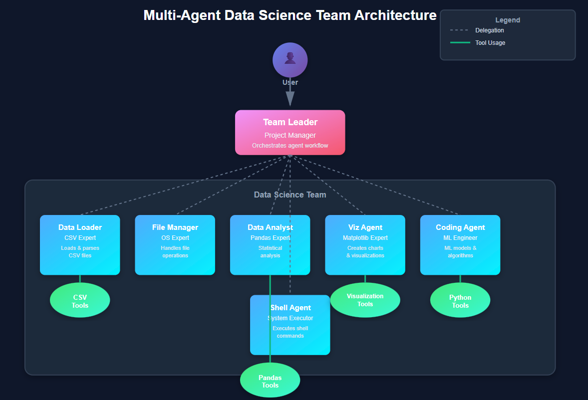
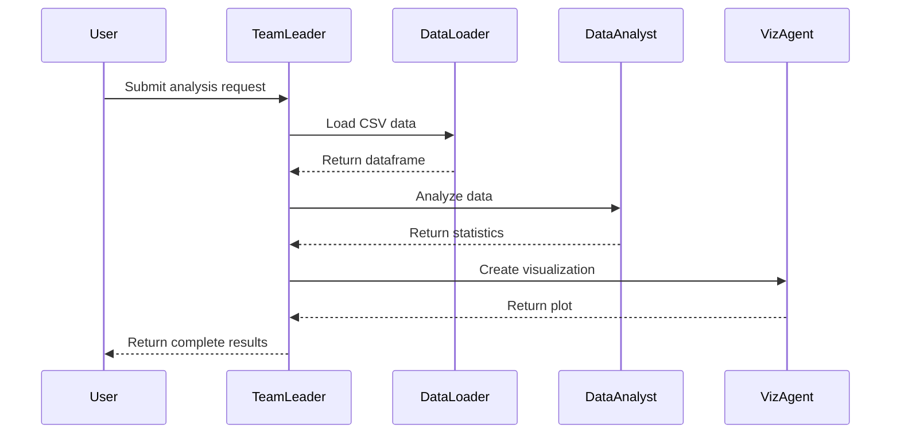

# 🤖 AGNO - Multi-Agent Data Science System

An intelligent multi-agent system that orchestrates specialized AI agents to handle complex data science workflows. Built with a hierarchical architecture where a Team Leader coordinates six specialized agents, each equipped with domain-specific tools for data processing, analysis, visualization, and machine learning tasks.


---

## 📸 System Architecture


The system follows a hierarchical multi-agent architecture where:
- **User** → Interacts with the system through a single entry point
- **Team Leader** → Orchestrates and delegates tasks to specialized agents
- **Specialized Agents** → Execute domain-specific tasks using dedicated tools
- **Tools** → Provide the technical capabilities for each agent



---

---

## 🎥 App Demo


---


## 🎯 Key Features

✅ **Hierarchical Agent System** - Team Leader manages workflow and delegates to specialized agents  
✅ **Domain-Specific Expertise** - Six specialized agents with dedicated tools  
✅ **Intelligent Task Routing** - Automatic task delegation based on requirements  
✅ **Tool Integration** - Seamless integration with CSV, Pandas, Matplotlib, and Python tools  
✅ **Scalable Architecture** - Easy to add new agents or tools  
✅ **Modular Design** - Each component is independent and maintainable

---

## 🏗️ Architecture Overview

### Agent Hierarchy

```
User
  └── Team Leader (Project Manager)
       ├── Data Loader (CSV Expert)
       ├── File Manager (OS Expert)
       ├── Data Analyst (Pandas Expert)
       ├── Viz Agent (Matplotlib Expert)
       ├── Coding Agent (ML Engineer)
       └── Shell Agent (System Executor)
```

### Agent Responsibilities

| Agent | Role | Capabilities | Tools |
|-------|------|--------------|-------|
| **Team Leader** | Project Manager | Orchestrates workflow, delegates tasks, manages agent coordination | - |
| **Data Loader** | CSV Expert | Loads and parses CSV files, handles data ingestion | CsvTools |
| **File Manager** | OS Expert | File operations, directory management, I/O operations | - |
| **Data Analyst** | Pandas Expert | Statistical analysis, data manipulation, feature engineering | PandasTools |
| **Viz Agent** | Matplotlib Expert | Creates charts, plots, and data visualizations | VisualizationTools |
| **Coding Agent** | ML Engineer | Builds ML models, implements algorithms, code generation | PythonTools |
| **Shell Agent** | System Executor | Executes shell commands, system-level operations | - |

---

## 📁 Project Structure

```
AGNO-DATA-SCIENCE/
│
├── .venv/                          # Virtual environment
│   ├── include/
│   ├── Lib/
│   ├── Scripts/
│   └── share/
│
├── data/                           # Data directory
│   └── features/
│       ├── test.csv
│       ├── train.csv
│       ├── car_data_cleaned_nishu.csv
│       ├── car_details.csv
│       └── data_cleaned.csv
│
├── models/                         # Trained models
│   └── preprocessor.joblib
│
├── plots/                          # Generated visualizations
│
├── reports/                        # Analysis reports
│
├── src/                            # Source code
│
├── .env                            # Environment variables
├── .gitignore                      # Git ignore file
├── .python-version                 # Python version specification
├── app.py                          # Main application
├── clean_car_data.py               # Data cleaning script
├── main.py                         # Entry point
├── memory.db                       # Agent memory database
├── pyproject.toml                  # Project configuration
├── README.md                       # Documentation
├── run_car_report.py               # Report generation
├── test_nishu.csv                  # Test dataset
└── uv.lock                         # Dependency lock file
```

---

## 🚀 Getting Started

### Prerequisites

- Python 3.8 or higher
- pip (Python package installer)
- Virtual environment (recommended)

### Installation

1. **Clone the repository**
   ```bash
   git clone https://github.com/yourusername/AGNO-DATA-SCIENCE.git
   cd AGNO-DATA-SCIENCE
   ```

2. **Create and activate virtual environment**
   ```bash
   # Windows
   python -m venv .venv
   .venv\Scripts\activate

   # Linux/Mac
   python3 -m venv .venv
   source .venv/bin/activate
   ```

3. **Install dependencies**
   ```bash
   pip install -r requirements.txt
   ```

4. **Set up environment variables**
   ```bash
   # Create .env file and add your configuration
   cp .env.example .env
   # Edit .env with your settings
   ```

### Quick Start

```bash
# Run the main application
python main.py

# Or run the Streamlit app
streamlit run app.py
```

---

## 💡 Usage Examples

### Example 1: Data Analysis Workflow

```python
from agno import TeamLeader

# Initialize the team leader
leader = TeamLeader()

# Request data analysis
result = leader.execute_task(
    task="Analyze car sales data and create visualizations",
    data_path="data/features/car_data_cleaned_nishu.csv"
)
```

### Example 2: ML Model Training

```python
# Request ML model training
result = leader.execute_task(
    task="Train a price prediction model using car features",
    data_path="data/features/train.csv",
    target_column="price"
)
```

### Example 3: Report Generation

```bash
# Generate analysis report
python run_car_report.py
```

---

## 🛠️ Technology Stack

- **Language**: Python 3.8+
- **Agent Framework**: Custom multi-agent system
- **Data Processing**: Pandas, NumPy
- **Visualization**: Matplotlib, Seaborn
- **Machine Learning**: Scikit-learn
- **Database**: SQLite (memory.db)
- **Web Interface**: Streamlit (optional)
- **Package Management**: pip, UV

---

## 🔧 Configuration

Configure the system by editing the `.env` file:

```env
# API Keys
OPENAI_API_KEY=your_api_key_here
GROQ_API_KEY=your_groq_key_here

# Model Configuration
MODEL_NAME=llama-3.3-70b-versatile
MAX_TOKENS=4096

# System Configuration
DEBUG_MODE=False
LOG_LEVEL=INFO
```

---

## 📊 Agent Communication Flow



---

## 🔍 Key Components

### 1. Team Leader Agent
- Receives user requests
- Breaks down complex tasks
- Delegates to appropriate agents
- Aggregates results

### 2. Data Processing Pipeline
- Data ingestion (Data Loader)
- Data cleaning (File Manager)
- Feature engineering (Data Analyst)

### 3. Analysis & Visualization
- Statistical analysis (Data Analyst)
- Chart generation (Viz Agent)
- Report creation (Team Leader)

### 4. ML Pipeline
- Model development (Coding Agent)
- Training & evaluation (Coding Agent)
- Model persistence (File Manager)

---

## 📈 Roadmap

- [ ] Add support for more data formats (Excel, JSON, Parquet)
- [ ] Implement real-time collaboration between agents
- [ ] Add natural language query interface
- [ ] Integrate deep learning models
- [ ] Create web-based dashboard
- [ ] Add agent performance monitoring
- [ ] Implement distributed agent execution
- [ ] Add support for cloud storage (S3, GCS)

---

## 🤝 Contributing

Contributions are welcome! Please follow these steps:

1. Fork the repository
2. Create a feature branch (`git checkout -b feature/AmazingFeature`)
3. Commit your changes (`git commit -m 'Add some AmazingFeature'`)
4. Push to the branch (`git push origin feature/AmazingFeature`)
5. Open a Pull Request

---

## 📝 License

This project is licensed under the MIT License - see the [LICENSE](LICENSE) file for details.

**Additional Terms**: Commercial use of this software is strictly prohibited without prior written permission from the author. Attribution must be given in all copies or substantial portions of the software.

---

## 👨‍💻 Author

**NISHU KUMAR**

- GitHub: [@yourusername](https://github.com/NISHU8875)
- LinkedIn: [Your LinkedIn](https://www.linkedin.com/in/nishu-kumar-b7a7b4247/)
- Email: nishantranjan8875@gmail.com

---

## 🙏 Acknowledgments

- Inspired by multi-agent AI systems and agentic workflows
- Built with modern AI/ML best practices
- Special thanks to the open-source community

---

## 📞 Support

If you have any questions or need help, please:

- Open an issue on GitHub
- Contact via email (nishantranjan8875@gmail.com)

---


**Made with ❤️ by [NISHU KUMAR]**